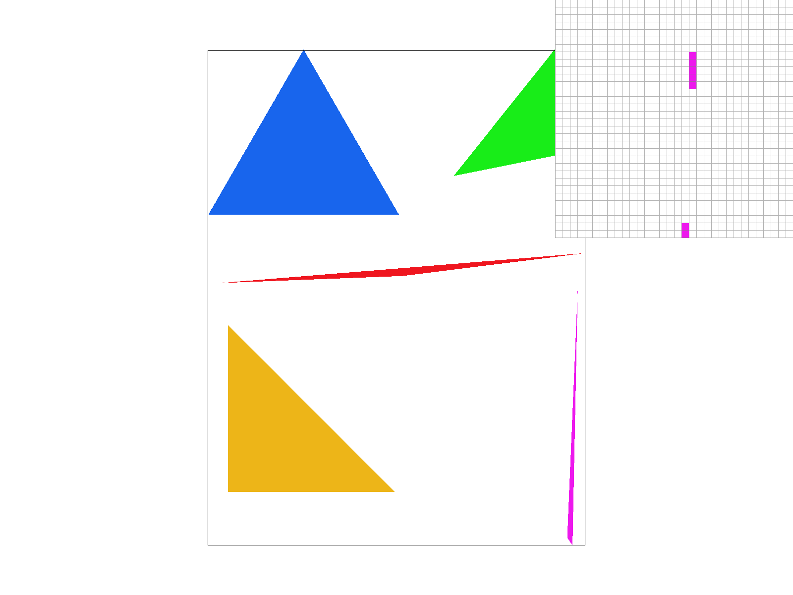

# CS 184, Project 1: Rasterizer

## Overview
In this project, we implemented a 2D rasterizer and related utilities around vector graphics rasterization. In the first half of the project, we implemented the core of the rasterizing system, including antialiasing via supersampling and linear and affine transformations. In the latter half of the project, we focused on adding textures to the rasterized graphics, including linear interpolation for gradient color textures, as well as pixel sampling and level sampling for texture mapping.

## Section I: Rasterization

### Part 1: Rasterizing single-color triangles

To rasterize a triangle, we first find the bounding box, which is the smallest rectangular region of the sampling buffer which contains every point on or inside the triangle. By only iterating through the pixels within the bounding box of the triangle, we avoid having to iterate many more pixels than necessary. The bounding box can be well-defined using the top left and bottom right coordinates, which can be calculating by taking the minimum and maximum of all x- and y-coordinates. Then we iterate through each pixel in the bounding box. For each pixel, we check to see if it lies on the same side of all three sides of the triangle; if so, we set that pixel in the sample buffer the appropriate color. Otherwise, we do nothing with the pixel, keeping the color possibly already written to that pixel.

Figure 1

### Part 2: Antialiasing triangles

However, naive rasterization is not very representative of the true vector graphic. In Figure 1, we can see that near the vertex of the thin triangle, there is a lot of aliasing. Supersampling is useful because we can antialias this effect by coloring a pixel to be more representative of the true vector graphic. For example, if 20% of a pixel is inside the triangle but 80% is outside, then we can color in the pixel to be a weighted average of the outside and inside colors.

To supersample our renders, we need to first make a modification to our sampling buffer. Since we now sample more than once per pixel, the size of our buffer needs to be larger by the factor of the supersampling rate. We also need to modify our rasterization process. For each pixel in the rasterization process, we iterate through all of the subpixels in that pixel. The number of subpixels is the supersampling rate; for a rate of 16, we iterate through 16 subpixels. For each subpixel, if its coordinate lies inside the triangle, we set its color in the sampling buffer; otherwise we leave it alone.

Finally, we need to reduce the sampling buffer to be displayable by converting it into a framebuffer. For each pixel in the sampling buffer, we take the average of all of the subpixel colors associated with that pixel, and write the average into the framebuffer.

Lastly, we need to ensure existing processes can handle the larger sampling buffer. For lines and points, we will not antialias them since there is no "inside"; instead, we must ensure that all of the subpixels associated with each pixel on a point or a line has the same solid color.

  <table style="width=100%">
    <tr>
      <td>
        
        <figcaption align="middle">Caption goes here.</figcaption>
      </td>
      <td>
        
        <figcaption align="middle">Caption goes here.</figcaption>
      </td>
    </tr>
     
    <tr>
      <td>
        
        <figcaption align="middle">Caption goes here.</figcaption>
      </td>
      <td>
        
        <figcaption align="middle">Caption goes here.</figcaption>
      </td>
    </tr>
  </table>

### Part 3: Transforms

To support linear and affine transformations, we use homogenous coordinates. The extra dimension allows us to compute translation while still using only matrix multiplication. Below is a rabbit wearing sunglasses.

## Section II: Sampling

### Part 4: Barycentric coordinates

Barycentric coordinates allow us to express the closeness of a given point to each of the 3 vertices of a triangle. For each vertex, if the corresponding barycentric coordinate is 1, the point is on the vertex, and if it is 0, the point is on the side of the triangle opposite of the vertex. (A more accurate interpretation is the signed distance from the side opposite to the vertex in terms of the height of the triangle from the vertex.) Below we see an example of a gradient-textured triangle whose color at each vertex is pure red, green, or blue.

A point close to a vertex will have the corresponding barycentric coordinate closer to 1, and vice versa. Between the red and blue vertex, we see a purple vertex, whose barycentric coordinate is near 0.5 for both the red and blue channels, and close to 0 for the green channel.

To compute the barycentric coordinates, we construct a matrix whose columns are the homogenous coordinates of each vertex of the triangle, and matrix multiply with the homogenous coordinate of the pixel coordinate in question. This gives us a vector whose entries are the barycentric coordinate of each vertex. Taking the weighted average of each vertex's color about the barycentric coordinates, we can compute the color of the current pixel.

### Part 5: "Pixel sampling" for texture mapping
In pixel sampling, we determine what colors to make each pixel in the displayed image by sampling in some way from the colors used in the source texture. The texture has its own "texture coordinate" system, so we use this for texture mapping by looking for the corresponding texture pixel ("texel") location to each pixel we draw, which can be done by using barycentric coordinates from known texture coordinates. This can result in non-integer texture coordinates, and so we have different ways to determine what texels to use for each pixel and how to sample from them for our final color of the pixel.

There are two primary methods of pixel sampling used in this part - nearest and bilinear. 

In nearest pixel sampling, for each pixel we are looking to color, we simply find the color of the nearest texel to that pixel in texture coordinates. 

In bilinear pixel sampling, we instead aim for a "weighted average" of surrounding texels. We do this by finding the four nearest texels and taking a weighted average of their colors according to the position of our pixel relative to those four texels.

Here is an example in the svg files where bilinear is noticeably better:

  <table style="width=100%">
    <tr>
      <td>
        
        <figcaption align="middle">Nearest, 1 sample/pixel.</figcaption>
      </td>
      <td>
        
        <figcaption align="middle">Nearest, 16 samples/pixel.</figcaption>
      </td>
    </tr>
     
    <tr>
      <td>
        
        <figcaption align="middle">Bilinear, 1 sample/pixel.</figcaption>
      </td>
      <td>
        
        <figcaption align="middle">Bilinear, 16 samples/pixel.</figcaption>
      </td>
    </tr>
  </table>

We can see that in the nearest examples, there are more "breaks" in the vertical indents on the tower, while the bilinear examples are more solid and more distinguishable.

In general, bilinear sampling will be noticeably better than nearest pixel sampling when there are very small/thin features, as they will be blurred into the area and discernable rather than potentially broken up.

### Part 6: "Level sampling" with mipmaps for texture mapping
In level sampling, we adjust what level of detail we use according to distance in order to fix artifact issues that can arise from sampling high-resolution textures for objects far away while preserving detail clarity for closer objects.

This is implemented using mipmaps that store progressively lower resolution versions of the image, allowing us to switch between lower and higher resolution images (or interpolate between them) as needed.

We determine what the level is at a pixel by calculating the difference between texture coordinates from the current pixel to the adjacent pixels, and then using that as an estimate for the derivatives in this formula from lecture:

From there we have three level sampling modes: L_ZERO uses level zero (the high resolution texture) for everything. L_NEAREST uses the nearest level (since our calculated result can be non-integer) at a pixel, and L_LINEAR interpolates between the closest layers as a weighted average.

For pixel sampling tradeoffs, we generally have that bilinear will be slower than nearest due to the added calculations needed, but will result in greater antialiasing power. However, memory cost should stay roughly the same, as we are not storing anything significant in addition, just doing more calculations.

For level sampling tradeoffs, L_NEAREST and L_LINEAR can be faster than L_ZERO due to sampling from lower resolution textures. However, they will take more memory to store the mipmaps since they store high and low resolution textures. For antialiasing power, L_NEAREST will give stronger antialiasing than L_ZERO due to reducing artifacts in faraway objects, however L_LINEAR wil give the strongest antialiasing by interpolating between layers to provide a smoother result.

Here is the image we fed to the program:

And here are our results:

  <table style="width=100%">
    <tr>
      <td>
        
        <figcaption align="middle">L_ZERO and P_NEAREST.</figcaption>
      </td>
      <td>
        
        <figcaption align="middle">L_ZERO and P_LINEAR.</figcaption>
      </td>
    </tr>
     
    <tr>
      <td>
        
        <figcaption align="middle">L_NEAREST AND P_NEAREST.</figcaption>
      </td>
      <td>
        
        <figcaption align="middle">L_NEAREST AND P_LINEAR.</figcaption>
      </td>
    </tr>
  </table>

[Link to this page](.)
