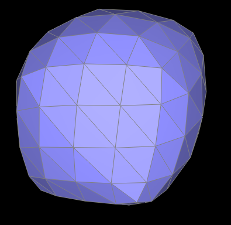
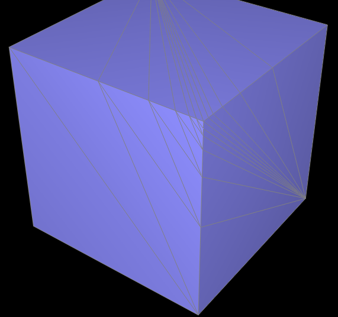

<!DOCTYPE html PUBLIC "-//W3C//DTD XHTML 1.0 Strict//EN" "http://www.w3.org/TR/xhtml1/DTD/xhtml1-strict.dtd">
<html xmlns="http://www.w3.org/1999/xhtml" xml:lang="en" lang="en">
<head>

<title>CS 184 Mesh Edit</title>
<meta http-equiv="content-type" content="text/html; charset=utf-8" />
<link href="https://fonts.googleapis.com/css?family=Open+Sans|Source+Sans+Pro" rel="stylesheet">

</head>

<body>

<h1 align="middle">CS 184: Computer Graphics and Imaging, Spring 2023</h1>
<h1 align="middle">Project 2: Mesh Edit</h1>
<h2 align="middle">Yuto Nishida, Alvin Xu</h2>

  

<h2 align="middle">Overview</h2>

	In this project, we implemented a triangle mesh datastructure and related functions around bezier curves and loop subdivision. In the first section of this project, we implemented de Casteljau's cubic bezier curve computation algorithm for both 1-dimensional curves and 2-dimensional surfaces. In the second section of this project, we implemented area-weighted vertex normals, edge flipping, edge splitting, and loop subdivision for mesh upsampling.

 

<h2 align="middle">Section I: Bezier Curves and Surfaces</h2>

<h3 align="middle">Part 1: Bezier Curves with 1D de Casteljau Subdivision</h3>

<b>
  Briefly explain de Casteljau's algorithm and how you implemented it in order to evaluate Bezier curves.
</b>

    De Casteljau's algorithm is a recursive algorithm that reduces the number of control points at every step. At every step, the next set of points is calculated by taking the weighted average of every pair of consecutive points from the step before. The weight is constant and does not change for each point on the final curve. In our implementation, we iterate through all of the points and compute the next set of points.

 

<b>
  Take a look at the provided .bzc files and create your own Bezier curve with 6 control points of your choosing. Use this Bezier curve for your screenshots below.
</b>
<!-- Example of including a single figure -->
<!--
	

<b>
  Show screenshots of each step / level of the evaluation from the original control points down to the final evaluated point. Press <kbd>E</kbd> to step through. Toggle <kbd>C</kbd> to show the completed Bezier curve as well.
</b>
<!-- Example of including multiple figures -->

  <table style="width:100%">
    <tr align="center">
      <td>
        
        <figcaption>Level 0</figcaption>
      </td>
      <td>
        
        <figcaption>Level 1</figcaption>
      </td>
    </tr>
     
    <tr align="center">
      <td>
        
        <figcaption>Level 2</figcaption>
      </td>
      <td>
        
        <figcaption>Level 3</figcaption>
      </td>
    </tr>
     
    <tr align="center">
      <td>
        
        <figcaption>Level 4</figcaption>
      </td>
      <td>
        
        <figcaption>Level 5</figcaption>
      </td>
    </tr>
    <tr align="center">
      <td>
        
        <figcaption>Level 5 with Curve</figcaption>
      </td>
    </tr>
  </table>

 

<b>
  Show a screenshot of a slightly different Bezier curve by moving the original control points around and modifying the parameter \(t\) via mouse scrolling.
</b>

	

	  
	

 

<h3 align="middle">Part 2: Bezier Surfaces with Separable 1D de Casteljau</h3>
<b>
  Briefly explain how de Casteljau algorithm extends to Bezier surfaces and how you implemented it in order to evaluate Bezier surfaces.
</b>

    The de Casteljau algorithm can be generalized to surfaces. By applying the weighted average process in one of the two dimensions first, and then applying the same process to the averages in the other dimension (since we already took the average, the averages form one set of points with a well-defined order), we can again compute a single point for every pair of weights (u,v).
    
 

<b>
  Show a screenshot of bez/teapot.bez (not .dae) evaluated by your implementation.
</b>

	

	  
	

 

<h2 align="middle">Section II: Triangle Meshes and Half-Edge Data Structure</h2>

<h3 align="middle">Part 3: Area-Weighted Vertex Normals</h3>

<b>
  Briefly explain how you implemented the area-weighted vertex normals.
</b>

    We iterated over each adjacent face to the vertex, and for each one we calculate the normal, weight it by its area, and sum up all of these results for each face. The normalization of that is our result.
    

    

    To get the normal, we calculate two vectors along the face by using the difference between vertices, then cross product those to get the normal (the cross product is perpendicular to both of the vectors). To find the face's area to weight this normal, we use the well-known mathematical fact that the area of a triangle is equal to the magnitude of the cross product of two vectors along its edges divided by two.
    
    

 

<b>
  Show screenshots of dae/teapot.dae (not .bez) comparing teapot shading with and without vertex normals. Use <kbd>Q</kbd> to toggle default flat shading and Phong shading.
</b>

    

  <table style="width:100%">
    <tr align="center">
      <td>
        
        <figcaption>Phong shading (with vertex normals)</figcaption>
      </td>
      <td>
        
        <figcaption>Default flat shading (without vertex normals)</figcaption>
      </td>
    </tr>
     
  </table>

 

<h3 align="middle">Part 4: Edge Flip</h3>
<b>
  Briefly explain how you implemented the edge flip operation and describe any interesting implementation / debugging tricks you have used.
</b>

    We followed the advice and carefully went through every component in groups and assigned pointers according to what they should be in the new result from an edge flip. We did this in groups, creating the variables for each of these components and then going through them sequentially and assigning what they would be by following the diagram in the spec for the state of each component before and after the flip. This implementation trick of keeping it organized in groups and working through these groups one by one made it much easier to maintain and walk through to ensure correctness, and eliminated our need for any debugging .

 

<b>
  Show screenshots of the teapot before and after some edge flips.
</b>

    

  <table style="width:100%">
    <tr align="center">
      <td>
        
        <figcaption>No flips</figcaption>
      </td>
      <td>
        
        <figcaption>Some flips</figcaption>
      </td>
    </tr>
     
  </table>

 

 

<b>
    Write about your eventful debugging journey, if you have experienced one.
</b>

    Since we carefully wrote out a diagram with all of our properties, we got all the assignments right the first try and did not have to do any debugging.

 

<h3 align="middle">Part 5: Edge Split</h3>
<b>
  Briefly explain how you implemented the edge split operation and describe any interesting implementation / debugging tricks you have used.
</b>

    We carefully created variables for each component related to an edge split, and then went through each category one by one and assigned everything according to what it should be in the new split. This included making new components and assigning new values (such as the new vertex in the middle and its position as the midpoint of the edge). We made sure to keep our implementation neat through these categories (vertices, then faces, then edges, then half-edges) in order to better organize it for debugging, which proved helpful once we ran into a problem as we could walk through each step and make sure it was assigned correctly.

 

<b>
    Show screenshots of a mesh before and after some edge splits. 
</b>

    

  <table style="width:100%">
    <tr align="center">
      <td>
        
        <figcaption>No splits</figcaption>
      </td>
      <td>
        
        <figcaption>Some splits</figcaption>
      </td>
    </tr>
     
  </table>

 

 

<b>
    Show screenshots of a mesh before and after a combination of both edge splits and edge flips.
</b>

    

  <table style="width:100%">
    <tr align="center">
      <td>
        
        <figcaption>No flips or splits</figcaption>
      </td>
      <td>
        
        <figcaption>Some flips and splits</figcaption>
      </td>
    </tr>
     
  </table>

 

 

<b>
    Write about your eventful debugging journey, if you have experienced one.
</b>

    Though we planned out all the properties with a diagram like the previous part, we ran into some issues with the program freezing upon trying to split. Walking through our code, we realized it was because we had a wrong assignment for a half-edge's next property that was creating a nonsensical geometry. After that, we ran into issues with gaps, which we solved after realizing we were not assigning the position of the new vertex created.

 

<b>
    If you have implemented support for boundary edges, show screenshots of your implementation properly handling split operations on boundary edges.
</b>

    We implemented this by walking through an example of a boundary edge and following the same process of assigning component properties in groups according to what they would be in the new model.

    

  <table style="width:100%">
    <tr align="center">
      <td>
        
        <figcaption>No boundary splits</figcaption>
      </td>
      <td>
        
        <figcaption>Some boundary splits</figcaption>
      </td>
    </tr>
     
  </table>

 

 

<h3 align="middle">Part 6: Loop Subdivision for Mesh Upsampling</h3>
<b>
  Briefly explain how you implemented the loop subdivision and describe any interesting implementation / debugging tricks you have used.
</b>

    We implemented the standard procedure of splitting every edge and then flipping the edges connecting an old and new vertex. We followed the spec's suggestion for the three steps to take to do this easier. 

    First, we calculate the new positions of both old and new vertices following the formula outlined in the spec and stored this in the "newPosition" variables of our components (current vertices and edges). We also mark current vertices as being an old vertex so we can use this info later for flips.

    Next, we do the actual splits and flips. We make sure to iterate only through edges in the original mesh by checking the isNew property we set in the first part. We also check our isNew properties to find edges connecting an old and new vertex to flip.

    Finally, we update all the positions with all the newPosition properties we calculated. Old vertices were easier since they directly referred to themselves, but newer vertices that had their position info set into the edge they were on were a little harder since we needed to match up new vertices with old edges. To do this we actually set this info in our previous step of splitting edges since we had a reference to the new vertex from our edge split there.

 

<b>
  Take some notes, as well as some screenshots, of your observations on how meshes behave after loop subdivision. What happens to sharp corners and edges? Can you reduce this effect by pre-splitting some edges?
</b>

    Generally the meshes become more smooth and round from more loop subdivision. Sharp corners and edges get smoothed out into round curves.

    

  <table style="width:100%">
    <tr align="center">
      <td>
        
        <figcaption>0 subdivisions</figcaption>
      </td>
      <td>
        
        <figcaption>1 subdivision</figcaption>
      </td>
    </tr>
     
    <tr align="center">
      <td>
        
        <figcaption>2 subdivisions</figcaption>
      </td>
      <td>
        
        <figcaption>3 subdivisions</figcaption>
      </td>
    </tr>
     
    <tr align="center">
      <td>
        
        <figcaption>4 subdivisions</figcaption>
      </td>
        <td>
        
        <figcaption>5 subdivisions</figcaption>
      </td>
    </tr>
  </table>

    We aimed to reduce this smoothing effect  by adding more edges and face (which adds smaller and smaller components) at the corner we are trying to keep relatively sharp. This ends up working since we have more faces/edges at this corner so even under subdivision there are many components in this area to subdivide and it is sharper than usual from the high concentration.

  <table style="width:100%">
    <tr align="center">
      <td>
        
        <figcaption>Modified mesh pre-subdivision</figcaption>
      </td>
      <td>
        
        <figcaption>Modified mesh post-subdivision</figcaption>
      </td>
    </tr>
     
  </table>

 

<b>
  Load dae/cube.dae. Perform several iterations of loop subdivision on the cube. Notice that the cube becomes slightly asymmetric after repeated subdivisions. Can you pre-process the cube with edge flips and splits so that the cube subdivides symmetrically? Document these effects and explain why they occur. Also explain how your pre-processing helps alleviate the effects.
</b>

    We saw in the above screenshots how the cube is asymmetric along diagonals, jutting out in certain vertices.

    Generally the asymmetry arises because the original vertex geometry is not radially symmetric. In particular, the diagonal edges along each face is skewing the upscaling to shorten in the direction of these edges, as they are not symmetric across the face.

    We were able to pre-process the cube to subdivide symmetrically by splitting the diagonal on each of the 6 faces, thus making each face radially symmetric (the edges form an X) and thus it subdivides evenly.

  <table style="width:100%">
    <tr align="center">
      <td>
        
        <figcaption>Modified mesh pre-subdivision</figcaption>
      </td>
      <td>
        
        <figcaption>Modified mesh post-subdivision</figcaption>
      </td>
    </tr>
     
  </table>
 

<b>
    If you have implemented any extra credit extensions, explain what you did and document how they work with screenshots.
</b>

    N/A

 

<a href=".">Link to this page</a>
